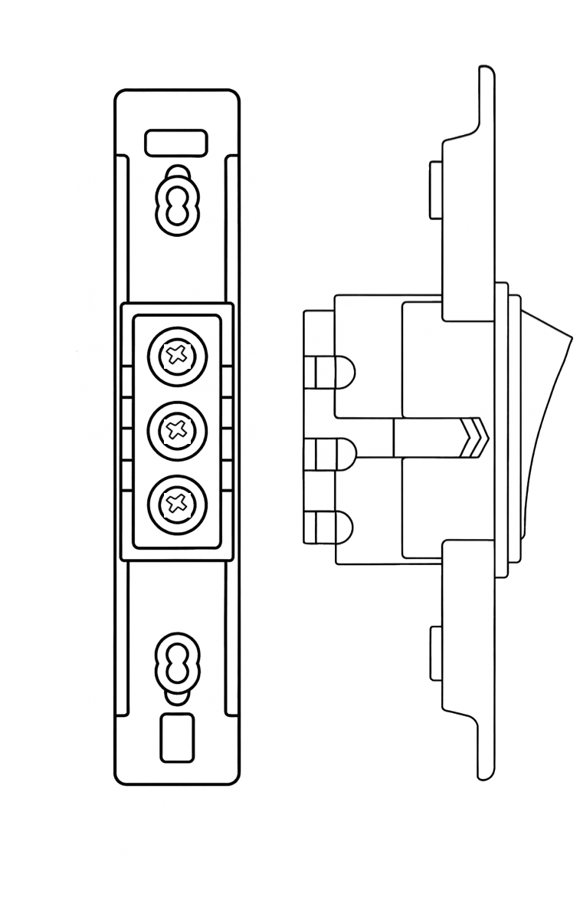
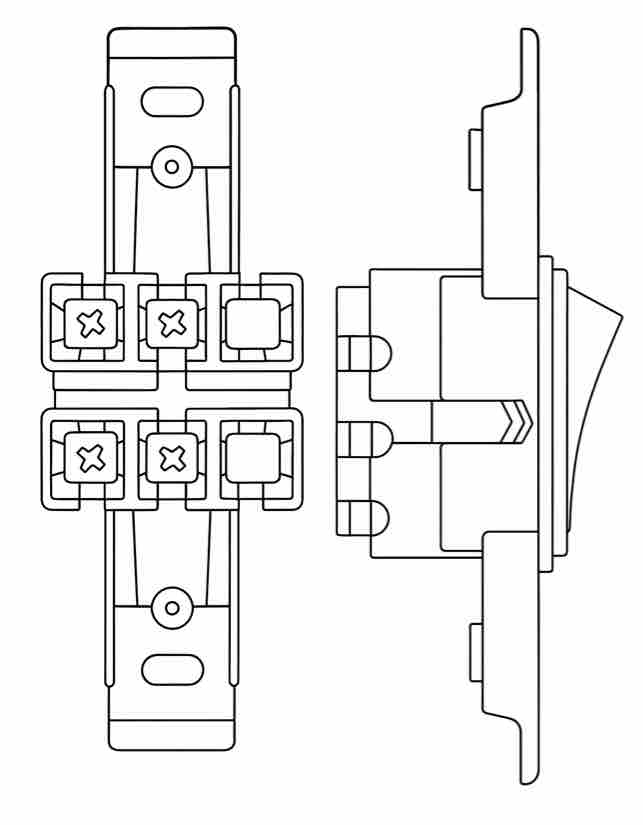
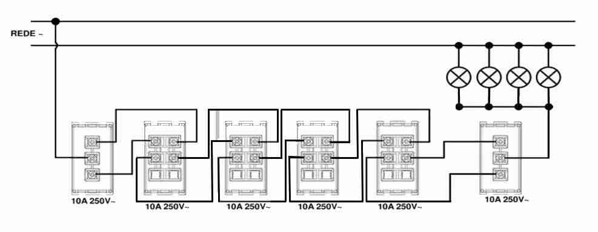
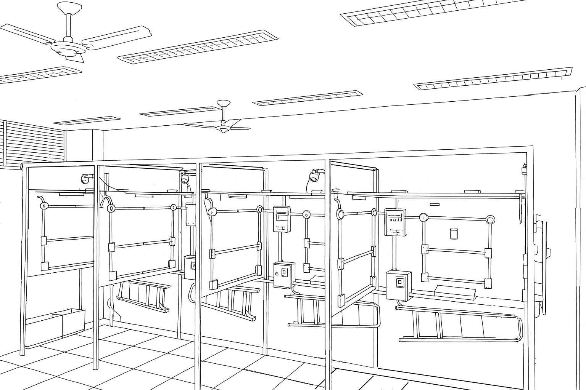
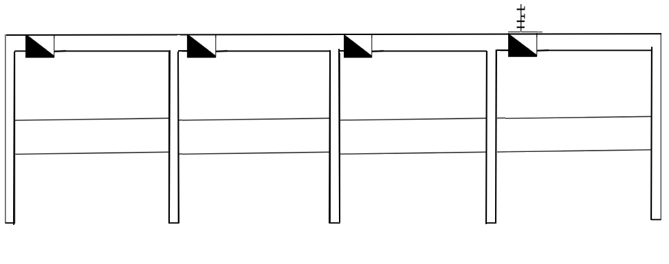

<td style="width: 10%;">
    
</td>

### **CENTRO FEDERAL DE EDUCAÇÃO TECNOLÓGICA DE MINAS GERAIS**  
### **Departamento de Engenharia Elétrica - CEFET-MG**  
### **Coordenação do Curso de Eletrotécnica**  

### Disciplina: **PLIP - Prática de Laboratório de Instalações Prediais**
### Guia de Aula – Instalação com 2 interruptores paralelos + 4 intermediários no box didático

##  Objetivos da Aula

Ao final desta atividade, o aluno será capaz de:

- Montar um circuito de iluminação com comando em cinco pontos (2 paralelos + 4 intermediários).  
- Representar graficamente eletrodutos, caixas de passagem e dispositivos em planta baixa.  
- Elaborar o diagrama unifilar correspondente ao circuito.  
- Executar e testar a instalação em 4 boxes didáticos interligados, cada um com um interruptor.  
- Compreender o funcionamento de interruptores paralelos e intermediários de acordo com normas e boas práticas.

---

##  Introdução

Esta atividade simula uma instalação real de uma circulação onde a mesma lâmpada pode ser acionada por cinco pontos diferentes.

### Interruptor Paralelo
O interruptor **paralelo** (também chamado de three-way) permite acionar uma lâmpada a partir de **dois pontos diferentes**.

**Características:**

- Possui **3 bornes**  
- **Comum (C)** → recebe fase (no primeiro) ou envia retorno a lâmpada (no último)  
- **Retornos paralelos** →  interligando os dois interruptores.
- Sempre utilizado em **par** (um no início e outro no fim do circuito).

**Aplicações:**

- Escadas  
- Corredores curtos  
- Quartos com duas portas

---

### Interruptor Intermediário
O interruptor **intermediário** (four-way) é usado quando o circuito precisa de **3 ou mais pontos de comando**.

**Características:**

- Possui **4 bornes**:  
  - 2 de entrada  
  - 2 de saída
- Sempre instalado **entre dois interruptores paralelos**.
- Alterna entre modo **reto** e modo **cruzado** dos retornos.

**Aplicações:**

- Corredores longos  
- Circulações amplas  
- Ambientes com várias entradas

---

**Comparação Rápida**

| Característica | Paralelo | Intermediário |
|----------------|-----------|----------------|
| Bornes | 3 | 4 |
| Posição | Início e fim | Meio do circuito |
| Função | Comutar retornos | Cruzar ou manter retornos |
| Pontos de comando | 2 | 3 ou mais |

---

Distribuição entre boxes:

- **Box 1:** Interruptor paralelo (Parede esquerda) - lâmpada 1 teto
- **Box 1:** Interruptor intermediário (Parede direita) 
- **Box 2:** Interruptor intermediário (Parede esquerda) - lâmpada 2 teto
- **Box 3:** Interruptor intermediário (Parede esquerda) - lâmpada 3 teto
- **Box 4:** Interruptor intermediário (Parede esquerda)  - lâmpada 4 teto  
- **Box 4:** Interruptor paralelo (Parede direita) 
- **Box 4:** Alimentação do circuito 

O circuito acima devera acionar acionar uma arandela  com uma lâmpadas de teto em cada box ( 4 lâmpadas em paralelo). 

---

##  Estrutura Física dos Boxes

Cada box possui quatro superfícies principais:

- Parede de fundo (com QDLF)  
- Parede esquerda  
- Parede direita  
- Teto  

A instalação desta aula utiliza 2 interruptores paralelos e 4 intermediários

---

##  Diagrama Unifilar - Desenho em Planta Baixa

**Atividade 1 – Planejamento**

O aluno deve produzir o desenho simbólico indicando:

- Traçado dos eletrodutos  
- Posição dos interruptores (1 por parede)  
- Caixas de passagem necessárias  
- Trajeto até o ponto de luz  
- Origem da alimentação (QDLF)

**Elementos obrigatórios**

- Linhas contínuas/tracejadas  
- Símbolos dos interruptores  
- Altura padrão (aprox. 1,20 m)  
- Identificação de cada box

**Instalação nas paredes  (QDLF / Box 4)**

- 01 DTMG monopolar  
- 01 Interruptor paralelo 
- 01 Interruptor intermediário  
- 01 lâmpada do teto 
- Eletroduto vindo do QDLF → seguindo ao Box 3   

**Parede Esquerda (Box 3)**

- 01 Interruptor intermediário  
- Eletroduto vindo do  Box 4 e seguindo para Box 2 

**Parede Direita (Box 2)**

- 01 Interruptor intermediário  
- Eletroduto vindo do Box 3 → seguindo ao Box 1  

**Parede Oposta (Box 1)**

- 01 Interruptor intermediário 
- 01 Interruptor paralelo  
- Eletroduto vindo do Box 2 

---

## Características da Instalação

- Sistema monofásico  
- Tensão: 127 V  
- Fiação: 1,5 mm² (iluminação)  
- Condutores necessários:
  - Fase  
  - Neutro 
  - Retorno 
 
 ---

##  Execução da Instalação

**a) Lançamento dos Condutores**

- Passar sonda pelos eletrodutos  
- Lançar neutro para o ponto de luz  
- Levar fase ao 1º interruptor paralelo  
- Distribuir retornos entre os interruptores:
	- Entre paralelos → 2 retornos  
	- Entre intermediários → pares de  retorno na entrada e saída  

---

**b) Conexões e Emendas**

- Emendar:

  - Luminária (neutro + retorno)  
  - Interruptores paralelos (comum + retornos)  
  - Intermediários (retorno entre 2 entradas + 2 saídas)  

- Garantir:

  - Aperto firme  
  - Isolação adequada  
  - Identificação dos condutores

---

**c) Testes e Energização**

- Solicitar inspeção do professor  
- Energizar o DTMG  
- Testar os 6 interruptores garantindo funcionamento independente  

---

**d) Desmontagem**

- Remover dispositivos sem retirar fios dos conectores  
- Guardar cabos  
- Organizar o Box e limpar o ambiente  

---
